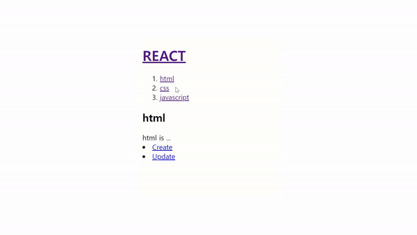
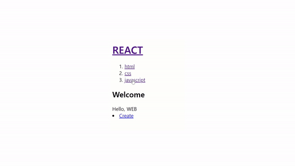

# React

## 리액트란?

- 프론트앤드 라이브러리가 등장하게 된 이유는 동적인 웹 페이지를 보다 효율적으로 유지 보수하고 관리할 수 있도록 도와주기 때문

- 사용자 정의 태그를 만드는 기술

## 왜 리액트인가?

- Component 단위 작성

  - 데이터와 화면을 하나로 묶어놓은 덩어리

  - UI를 재사용 가능한 개별적인 여러 조각으로 나누고, 각 조각을 개별적으로 나누어 코딩한다.

- JSX

  - JSX(Javascript + xml)는 자바스크립트에 대한 확장 구문으로서, 리액트에서 element(요소)를 제공해 준다.

  - JSX를 통해 컴포넌트를 구성하는 데 쉽게 적응할 수 있다는 장점이 있다.

- 간단한 사용 예시

```js
function Header() {
  return (
    <header>
      <h1>
        <a href="/">WEB</a>
      </h1>
    </header>
  );
}

function Nav() {
  return (
    <nav>
      <ol>
        <li>
          <a href="1.html">HTML</a>
        </li>
        <li>
          <a href="1.html">CSS</a>
        </li>
        <li>
          <a href="1.html">JavaScript</a>
        </li>
      </ol>
    </nav>
  );
}

function Article() {
  return (
    <article>
      <h2>HTML</h2>
      HTML is HyperText Markup Language.
    </article>
  );
}
function App() {
  return (
    <div>
      <Header></Header>
      <Nav></Nav>
      <Article></Article>
    </div>
  );
}
export default App;
```


위와 같이 header, nav, article 태그들을 따로 JSX 문법을 사용하여 컴포넌트로 만들어서 코드를 작성하였다.

이렇게 컴포넌트, JSX를 사용함으로써 재사용과 유지보수가 매우 쉬워졌다.

하지만, 여태껏 html css javascript순으로 웹페이지에 보여줬던걸 이제는 반대로 생각해야한다.

리액트하나로 html css javascript 구현이 모두 가능하므로 **역순**으로 만든다는 생각을 하자.

리액트의 가장 기본이 되는 **CRUD**에 대해서 학습해보자.

## READ

### props

`Props`는 컴포넌트의 외부에서 사용하는 입력값으로 우리가 만든 컴포넌트에 어떻게 장착할지 배워보자.

```js
function Header(props) {
  return (
    <header>
      <h1>
        <a href="/">{props.title}</a>
      </h1>
    </header>
  );
}

function Nav(props) {
  const lis = [];
  for (let i = 0; i < props.topics.length; i++) {
    let t = props.topics[i];
    lis.push(
      <li key={t.id}>
        <a href={"/read" / +t.id}>{t.title}</a>
      </li>
    );
  }
  return (
    <nav>
      <ol>{lis}</ol>
    </nav>
  );
}

function Article(props) {
  return (
    <article>
      <h2>{props.title}</h2>
      {props.body}
    </article>
  );
}
function App() {
  const topics = [
    { id: 1, title: "html", body: "html is ..." },
    { id: 2, title: "css", body: "css is ..." },
    { id: 3, title: "javascript", body: "javascript is ..." },
  ];
  return (
    <div>
      <Header title="REACT"></Header>
      <Nav topics={topics}></Nav>
      <Article title="Welcome" body="Hello, WEB"></Article>
      <Article title="Hi" body="Hello, REACT"></Article>
    </div>
  );
}
export default App;
```

처음에 올린 코드와 동일하게 동작하는 코드이지만 `props`를 사용해 동적으로 태그를 만들 수 있다.

App 함수에서 `topics` 배열을 만들고, Nav함수에서 props로 이것을 받고, 반복문을 통해 내용을 순회하면서 태그 안에다 넣고, 반환하였다.

여기서 주의할점은 `<li key={t.id}>`와 같이 key값을 설정해야하는데 이것은 자동으로 생성한 태그의 경우에는 태그들을 키 값을 추적함으로써 성능을 높이기 위해서이다.

### 이벤트

1. **`Header` 태그를 클릭했을 때 `alert`창을 띄우도록 해보자.**

2. **`nav`태그 안에 `li`태그 들을 클릭할 시에 `alert`창으로 각각 `topics`에 저장되어있는 `id`값을 출력하도록 해보자.**

```js
function Header(props) {
  return (
    <header>
      <h1>
        <a
          href="/"
          onClick={function (event) {
            event.preventDefault();
            props.onChangeMode();
          }}
        >
          {props.title}
        </a>
      </h1>
    </header>
  );
}

function Nav(props) {
  const lis = [];
  for (let i = 0; i < props.topics.length; i++) {
    let t = props.topics[i];
    lis.push(
      <li key={t.id}>
        <a
          id={t.id}
          href={"/read/" + t.id}
          onClick={(event) => {
            event.preventDefault();
            props.onChangeMode(event.target.id);
          }}
        >
          {t.title}
        </a>
      </li>
    );
  }
  return (
    <nav>
      <ol>{lis}</ol>
    </nav>
  );
}

function App() {
  const topics = [
    { id: 1, title: "html", body: "html is ..." },
    { id: 2, title: "css", body: "css is ..." },
    { id: 3, title: "javascript", body: "javascript is ..." },
  ];
  return (
    <div>
      <Header
        title="REACT"
        onChangeMode={() => {
          alert("Header");
        }}
      ></Header>
      <Nav
        topics={topics}
        onChangeMode={(id) => {
          alert(id);
        }}
      ></Nav>
    </div>
  );
}
```

- 1번

  우선 `App` 함수에서 `onChangeMode`함수를 선언하고, 이걸 `Header` 컴포넌트에서 클릭 이벤트에 대한 콜백함수 안에서 호출하였다.

  `event.preventDefault()`는 기존 a태그의 동작을 막아 페이지의 리로드를 막는다.

- 2번

  `onChangeMode` 함수 안에서 인자로 받은 `id`값을 출력하도록 되어있는데 이 값을 `Nav` 컴포넌트에서 함수의 인자로 보낼 때
  따로 `id={t.id}`로 지정해줘서 각각 1, 2, 3을 가리키도록 한다.

  그리고 이벤트가 발생했을때 `event.target.id`로 접근한다.

  여기서 `event.target`는 `a` 태그 객체를 반환한다.

## state


상자가 컴포넌트라 할 때, 입력은 `prop`에 해당한다. 그리고 그것을 컴포넌트 함수가 처리해서 return값을 반환한다. 이때 반환된 값을 토대로 UI가 만들어진다.

`props`과 `state` 모두 이 값이 변경되면 새로운 return값을 만든다. 하지만 둘의 차이점이 무엇일까?

- props : 컴포넌트를 사용하는 **외부자**를 위한 데이터

- state : 컴포넌트를 만드는 **내부자**를 위한 데이터

**`state`를 통해 각 li 태그들의 링크를 눌렀을때 다른 창을 보이도록 해보자.**


```js
function App() {
  const mode = "WELCOME";
  const topics = [
    { id: 1, title: "html", body: "html is ..." },
    { id: 2, title: "css", body: "css is ..." },
    { id: 3, title: "javascript", body: "javascript is ..." },
  ];
  let content = null;
  if (mode === "WELCOME") {
    content = <Article title="Welcome" body="Hello, WEB"></Article>;
  } else if (mode === "READ") {
    content = <Article title="READ" body="Hello, READ"></Article>;
  }
  return (
    <div>
      <Header
        title="REACT"
        onChangeMode={() => {
          mode = "WELCOME";
        }}
      ></Header>
      <Nav
        topics={topics}
        onChangeMode={(id) => {
          mode = "READ";
        }}
      ></Nav>
      {content}
    </div>
  );
}
```

지역변수로 `mode` 변수를 두고, 이 값에 따라 `content`를 변경시켜 클릭했을때, 태그를 동적으로 변화시키려 한다.

하지만 아무런 변화가 없고, 오류가 뜬다. 이유는 무엇일까?

우리가 원하는 동작원리는 이렇다.

클릭을 통해 `mode` 값이 변경되면 `App` 함수를 새로 실행해 return값이 반환되어 UI에 반영되어야 하는데 `App` 함수가 다시 실행되지 않는다.

**이때 `state`를 사용하면 해결이 가능하다.**

```js
const _mode = useState("WELCOME");
const mode = _mode[0];
const setMode = _mode[1];
```

우선 지역변수 `_mode`를 상태(state)로 만들어보자.

인자로는 초기값이 들어간다.

mode에 상태값이 리턴이 되는데 상태값을 확인해보자.


콘솔에 출력해보면 배열이 반환되는데

0번 인덱스는 상태의 값

1번 인덱스는 상태의 값을 변경할때의 사용하는 함수가 들어있다.

```js
const [mode, setMode] = useState("WELCOME");
```

보통은 위와 같이 구조분해를 사용해서 나타낸다.

이제 `state`를 활용한 코드를 살펴보자.

```js
function Header(props) {
  return (
    <header>
      <h1>
        <a
          href="/"
          onClick={function (event) {
            event.preventDefault();
            props.onChangeMode();
          }}
        >
          {props.title}
        </a>
      </h1>
    </header>
  );
}

function Nav(props) {
  const lis = [];
  for (let i = 0; i < props.topics.length; i++) {
    let t = props.topics[i];
    lis.push(
      <li key={t.id}>
        <a
          id={t.id}
          href={"/read/" + t.id}
          onClick={(event) => {
            event.preventDefault();
            props.onChangeMode(Number(event.target.id));
          }}
        >
          {t.title}
        </a>
      </li>
    );
  }
  return (
    <nav>
      <ol>{lis}</ol>
    </nav>
  );
}

function Article(props) {
  return (
    <article>
      <h2>{props.title}</h2>
      {props.body}
    </article>
  );
}
function App() {
  const [mode, setMode] = useState("WELCOME");
  const [id, setId] = useState(null);
  const topics = [
    { id: 1, title: "html", body: "html is ..." },
    { id: 2, title: "css", body: "css is ..." },
    { id: 3, title: "javascript", body: "javascript is ..." },
  ];
  let content = null;
  if (mode === "WELCOME") {
    content = <Article title="Welcome" body="Hello, WEB"></Article>;
  } else if (mode === "READ") {
    let title,
      body = null;
    for (let i = 0; i < topics.length; i++) {
      if (topics[i].id === id) {
        title = topics[i].title;
        body = topics[i].body;
      }
    }
    content = <Article title={title} body={body}></Article>;
  }
  return (
    <div>
      <Header
        title="REACT"
        onChangeMode={() => {
          setMode("WELCOME");
        }}
      ></Header>
      <Nav
        topics={topics}
        onChangeMode={(id) => {
          setMode("READ");
          setId(id);
        }}
      ></Nav>
      {content}
    </div>
  );
}
```

`Nav` 태그를 누르면 `Mode`를 `setMode`를 통하여 `App` 함수가 재 실행되어 READ로 변경한다.

또한 `SetId`를 통하여 `Nav` 컴포넌트 함수에서 전달한 'id'값을 `App` 함수 안에서 반복문을 통해

`topics` 배열을 돌며 'id'값이 일치하는지 확인하고 그 값을 통하여 컨텐츠를 변경하여 return하며 UI를 변경시킨다.

이때 중요한 것은

```js
<a
  id={t.id}
  href={"/read/" + t.id}
  onClick={(event) => {
    event.preventDefault();
    props.onChangeMode(Number(event.target.id));
  }}
>
```

`Nav` 컴포넌트 함수에서 `id={t.id}`로 선언한 순간 id값은 문자열로 바뀌기 때문에 함수를 호출할때 `Number`로 감싸서 숫자로 변경시켜서 전달해야 한다.

## CREATE

**`Create` 을 누르면 폼 태그가 생성되고, 폼에 정보를 입력한후 제출을 하면 4번부터 새로 목록이 생기고, 자동으로 그 목록의 내부로 이동하는 기능을 구현해보자.**

```js
import { useState } from "react";

function Header(props) {}

function Nav(props) {}

function Article(props) {}

function Create(props) {
  return (
    <article>
      <h2>Create</h2>
      <form
        onSubmit={(event) => {
          // 폼을 제출하였을때 발생하는 이벤트
          event.preventDefault();
          const title = event.target.title.value;
          const body = event.target.body.value;
          props.onCreate(title, body);
        }}
      >
        <p>
          <input type="text" name="title" placeholder="title" />
        </p>
        <textarea name="body" placeholder="body"></textarea>
        <p>
          <input type="submit" value="Create"></input>
        </p>
      </form>
    </article>
  );
}

function App() {
  const [mode, setMode] = useState("WELCOME");
  const [id, setId] = useState(null);
  const [nextId, setNextId] = useState(4);
  const [topics, setTopics] = useState([
    // state로 승격
    { id: 1, title: "html", body: "html is ..." },
    { id: 2, title: "css", body: "css is ..." },
    { id: 3, title: "javascript", body: "javascript is ..." },
  ]);
  let content = null;
  if (mode === "WELCOME") {
    content = <Article title="Welcome" body="Hello, WEB"></Article>;
  } else if (mode === "READ") {
    let title,
      body = null;
    for (let i = 0; i < topics.length; i++) {
      if (topics[i].id === id) {
        title = topics[i].title;
        body = topics[i].body;
      }
    }
    content = <Article title={title} body={body}></Article>;
  } else if (mode === "CREATE") {
    content = (
      <Create
        onCreate={(_title, _body) => {
          const newTopic = { id: nextId, title: _title, body: _body };
          const newTopics = [...topics];
          newTopics.push(newTopic);
          setTopics(newTopics); // reference 타입은 복사해서 넘기기
          setId(nextId);
          setMode("READ"); // 본문 이동
          setNextId(nextId + 1);
        }}
      ></Create>
    );
  }

  return (
    <div>
      <Header
        title="REACT"
        onChangeMode={() => {
          setMode("WELCOME");
        }}
      ></Header>
      <Nav
        topics={topics}
        onChangeMode={(id) => {
          setMode("READ");
          setId(id);
        }}
      ></Nav>
      {content}
      <a
        href="/create"
        onClick={(event) => {
          event.preventDefault();
          setMode("CREATE");
        }}
      >
        Create
      </a>
    </div>
  );
}
export default App;
```

따로 `CREATE` 컴포넌트를 만들어 create를 클릭 시 모드를 CREATE로 바꾸고 컴포넌트안에서 `onCreate`함수 인자로 `form` 태그의 값들을 보내 `App`함수에서 return 값을 갱신하여 UI를 변경시켰다.

```js
const newTopic = { id: nextId, title: _title, body: _body };
const newTopics = [...topics];
newTopics.push(newTopic);
setTopics(newTopics); // reference 타입은 복사해서 넘기기
setId(nextId);
setMode("READ"); // 생성한 번호로 페이지 이동
setNextId(nextId + 1);
```

`onCreate`를 자세히 살펴보면 state로 승격시킨 id값을 추가해 `newTopic`를 생성한다.

여기서 복사를 하는 이유는 무엇일까?


**내부적으로 set함수의 인자로 받은 값이 원본 값인지 아닌지 판단하여, 원본 값일 경우 렌더링을 하지 않는다.**

즉, 배열을 그대로 넘기면 아무 변화가 일어나지 않는다.

따라서 인자값이 `primitive` 값이 아닌 `reference`타입일 경우 복사를 해줘서 넘겨야 한다.

## Update(가장 난이도가 높음)



```js
import { useState } from "react";

function Header(props) {}

function Nav(props) {}

function Article(props) {}

function Create(props) {}

function Update(props) {
  const [title, setTitle] = useState(props.title); // state로 환승(내부에서 변경하기 위해)
  const [body, setBody] = useState(props.body);
  return (
    <article>
      <h2>Update</h2>
      <form
        onSubmit={(event) => {
          // 폼을 제출하였을때 발생하는 이벤트
          event.preventDefault();
          const title = event.target.title.value;
          const body = event.target.body.value;
          props.onUpdate(title, body);
        }}
      >
        <p>
          <input
            type="text"
            name="title"
            placeholder="title"
            value={title}
            onChange={(event) => {
              setTitle(event.target.value);
            }}
          />
        </p>
        <textarea
          name="body"
          placeholder="body"
          value={body}
          onChange={(event) => {
            setBody(event.target.value);
          }}
        ></textarea>
        <p>
          <input type="submit" value="Update"></input>
        </p>
      </form>
    </article>
  );
}

function App() {
  const [mode, setMode] = useState("WELCOME");
  const [id, setId] = useState(null);
  const [nextId, setNextId] = useState(4);
  const [topics, setTopics] = useState([
    // state로 승격
    { id: 1, title: "html", body: "html is ..." },
    { id: 2, title: "css", body: "css is ..." },
    { id: 3, title: "javascript", body: "javascript is ..." },
  ]);
  let content = null;
  let contextControl = null; // mode가 'READ'일때만
  if (mode === "WELCOME") {
    content = <Article title="Welcome" body="Hello, WEB"></Article>;
  } else if (mode === "READ") {
    let title,
      body = null;
    for (let i = 0; i < topics.length; i++) {
      if (topics[i].id === id) {
        title = topics[i].title;
        body = topics[i].body;
      }
    }
    content = <Article title={title} body={body}></Article>;
    contextControl = (
      <li>
        <a
          href={"/update" + id}
          onClick={(event) => {
            event.preventDefault();
            setMode("UPDATE");
          }}
        >
          Update
        </a>
      </li>
    );
  } else if (mode === "CREATE") {
    content = (
      <Create
        onCreate={(_title, _body) => {
          const newTopic = { id: nextId, title: _title, body: _body };
          const newTopics = [...topics];
          newTopics.push(newTopic);
          setTopics(newTopics); // reference 타입은 복사해서 넘기기
          setId(nextId);
          setMode("READ");
          setNextId(nextId + 1);
        }}
      ></Create>
    );
  } else if (mode === "UPDATE") {
    let title,
      body = null;
    for (let i = 0; i < topics.length; i++) {
      if (topics[i].id === id) {
        title = topics[i].title;
        body = topics[i].body;
      }
    }
    content = (
      <Update
        title={title}
        body={body}
        onUpdate={(title, body) => {
          const newTopics = [...topics];
          const updatedTopic = { id: id, title: title, body: body };
          for (let i = 0; i < newTopics.length; i++) {
            if (newTopics[i].id === id) {
              newTopics[i] = updatedTopic;
              break;
            }
          }
          setTopics(newTopics);
          setMode("READ");
        }}
      ></Update>
    );
  }

  return (
    <div>
      <Header
        title="REACT"
        onChangeMode={() => {
          setMode("WELCOME");
        }}
      ></Header>
      <Nav
        topics={topics}
        onChangeMode={(id) => {
          setMode("READ");
          setId(id);
        }}
      ></Nav>
      {content}
      <li>
        <a
          href="/create"
          onClick={(event) => {
            event.preventDefault();
            setMode("CREATE");
          }}
        >
          Create
        </a>
      </li>
      {contextControl}
    </div>
  );
}
export default App;
```

`Update` 폼은 기존의 데이터기반으로 수정을 해야 하니까 기존의 데이터를 가지고 있어야한다. 이 데이터는 `App`함수의 READ를 읽어와 `props`로 넘긴다.

이제 각 li 태그를 누르고 update 클릭 시 본문 내용이 저절로 뜬다.

하지만 수정이 불가능하다.

`props` 값은 메인이 되는 유저가 컴포넌트에 내린 어명과도 같기 때문에 바꿀수가 없다.

따라서 props를 **state**로 환승해야 한다.

```
props : 사용자가 내부로 전달하는 값
state : 내부자가 사용 하는 데이터, 내부에서 변경 가능
```

하지만 이렇게 해도 여전히 변경되지 않는다.

html에서 `onChange`는 값이 입력되고, 마우스가 바깥으로 나가야 이벤트가 발생되지만 리액트에서는 **값을 입력할때마다** 이벤트가 발생함

입력할때마다 `setTitle`함수가 실행되고 그때마다 컴포넌트가 다시 랜더링되면서 새로운 값이 `value`에 할당되는 방식이다.

이후에 `Update` 버튼을 클릭하면 `onSubmit`을 호출되고, `title`과 `body`값을 `onUpdate`로 전달한다.

`id`값은 READ할때 이미 세팅이 되어있기 때문에 그대로 쓴다.

## Delete



```js
contextControl = (
  <>
    <li>
      <a
        href={"/update" + id}
        onClick={(event) => {
          event.preventDefault();
          setMode("UPDATE");
        }}
      >
        Update
      </a>
    </li>
    <li>
      <input
        type="button"
        value="Delete"
        onClick={() => {
          const newTopics = [];
          for (let i = 0; i < topics.length; i++) {
            if (topics[i].id !== id) {
              newTopics.push(topics[i]);
            }
          }
          setTopics(newTopics);
          setMode("WELCOME");
        }}
      />
    </li>
  </>
);
```

`Delete` 버튼을 누를 시 현재 선택된 id와 같은 id를 가진 topics만 빼고 `newTopic`에 할당하였다.

### 완성된 전체 코드

```js
import { useState } from "react";

function Header(props) {
  return (
    <header>
      <h1>
        <a
          href="/"
          onClick={function (event) {
            event.preventDefault();
            props.onChangeMode();
          }}
        >
          {props.title}
        </a>
      </h1>
    </header>
  );
}

function Nav(props) {
  const lis = [];
  for (let i = 0; i < props.topics.length; i++) {
    let t = props.topics[i];
    lis.push(
      // 자동으로 생성한 태그의 경우에는 태그들을 키 값을 추적해야함으로써 성능을 높인다.
      <li key={t.id}>
        <a
          id={t.id}
          href={"/read/" + t.id}
          onClick={(event) => {
            event.preventDefault();
            props.onChangeMode(Number(event.target.id));
          }}
        >
          {t.title}
        </a>
      </li>
    );
  }
  return (
    <nav>
      <ol>{lis}</ol>
    </nav>
  );
}

function Article(props) {
  return (
    <article>
      <h2>{props.title}</h2>
      {props.body}
    </article>
  );
}

function Create(props) {
  return (
    <article>
      <h2>Create</h2>
      <form
        onSubmit={(event) => {
          // 폼을 제출하였을때 발생하는 이벤트
          event.preventDefault();
          const title = event.target.title.value;
          const body = event.target.body.value;
          props.onCreate(title, body);
        }}
      >
        <p>
          <input type="text" name="title" placeholder="title" />
        </p>
        <textarea name="body" placeholder="body"></textarea>
        <p>
          <input type="submit" value="Create"></input>
        </p>
      </form>
    </article>
  );
}

function Update(props) {
  const [title, setTitle] = useState(props.title); // state로 환승(내부에서 변경하기 위해)
  const [body, setBody] = useState(props.body);
  return (
    <article>
      <h2>Update</h2>
      <form
        onSubmit={(event) => {
          // 폼을 제출하였을때 발생하는 이벤트
          event.preventDefault();
          const title = event.target.title.value;
          const body = event.target.body.value;
          props.onUpdate(title, body);
        }}
      >
        <p>
          <input
            type="text"
            name="title"
            placeholder="title"
            value={title}
            onChange={(event) => {
              setTitle(event.target.value);
            }}
          />
        </p>
        <p>
          <textarea
            name="body"
            placeholder="body"
            value={body}
            onChange={(event) => {
              setBody(event.target.value);
            }}
          ></textarea>
        </p>
        <p>
          <input type="submit" value="Update"></input>
        </p>
      </form>
    </article>
  );
}

function App() {
  const [mode, setMode] = useState("WELCOME");
  const [id, setId] = useState(null);
  const [nextId, setNextId] = useState(4);
  const [topics, setTopics] = useState([
    // state로 승격
    { id: 1, title: "html", body: "html is ..." },
    { id: 2, title: "css", body: "css is ..." },
    { id: 3, title: "javascript", body: "javascript is ..." },
  ]);
  let content = null;
  let contextControl = null; // mode가 'READ'일때만
  if (mode === "WELCOME") {
    content = <Article title="Welcome" body="Hello, WEB"></Article>;
  } else if (mode === "READ") {
    let title,
      body = null;
    for (let i = 0; i < topics.length; i++) {
      if (topics[i].id === id) {
        title = topics[i].title;
        body = topics[i].body;
      }
    }
    content = <Article title={title} body={body}></Article>;
    contextControl = (
      <>
        <li>
          <a
            href={"/update" + id}
            onClick={(event) => {
              event.preventDefault();
              setMode("UPDATE");
            }}
          >
            Update
          </a>
        </li>
        <li>
          <input
            type="button"
            value="Delete"
            onClick={() => {
              const newTopics = [];
              for (let i = 0; i < topics.length; i++) {
                if (topics[i].id !== id) {
                  newTopics.push(topics[i]);
                }
              }
              setTopics(newTopics);
              setMode("WELCOME");
            }}
          />
        </li>
      </>
    );
  } else if (mode === "CREATE") {
    content = (
      <Create
        onCreate={(_title, _body) => {
          const newTopic = { id: nextId, title: _title, body: _body };
          const newTopics = [...topics];
          newTopics.push(newTopic);
          setTopics(newTopics); // reference 타입은 복사해서 넘기기
          setId(nextId);
          setMode("READ");
          setNextId(nextId + 1);
        }}
      ></Create>
    );
  } else if (mode === "UPDATE") {
    let title,
      body = null;
    for (let i = 0; i < topics.length; i++) {
      if (topics[i].id === id) {
        title = topics[i].title;
        body = topics[i].body;
      }
    }
    content = (
      <Update
        title={title}
        body={body}
        onUpdate={(title, body) => {
          const newTopics = [...topics];
          const updatedTopic = { id: id, title: title, body: body };
          for (let i = 0; i < newTopics.length; i++) {
            if (newTopics[i].id === id) {
              newTopics[i] = updatedTopic;
              break;
            }
          }
          setTopics(newTopics);
          setMode("READ");
        }}
      ></Update>
    );
  }

  return (
    <div>
      <Header
        title="REACT"
        onChangeMode={() => {
          setMode("WELCOME");
        }}
      ></Header>
      <Nav
        topics={topics}
        onChangeMode={(id) => {
          setMode("READ");
          setId(id);
        }}
      ></Nav>
      {content}
      <li>
        <a
          href="/create"
          onClick={(event) => {
            event.preventDefault();
            setMode("CREATE");
          }}
        >
          Create
        </a>
      </li>
      {contextControl}
    </div>
  );
}
export default App;
```

---

내 생각보다 많이 어려웠다.

기존에 html => css => javascript 식으로 코드를 짜는 것과 반대로 javascript => html/css 식으로 코드를 짜니 신기하였고, 컴포넌트를 활용하니까 좋은 것 같긴 한데 익숙하지 않아서 그런지 엄청나게 효율적으로 느껴지지는 않는다.

CRUD 라는 필수적이고 핵심적인 기능을 배워서 좋았고 계속계속 코드와 영상자료를 돌려봐야 겠다.

다른 리액트 강의를 아직 보진 않았지만 입문자에게 생활코딩 리액트 강의는 매우 좋은 것 같다.

## 참고자료

https://www.youtube.com/playlist?list=PLuHgQVnccGMCOGstdDZvH41x0Vtvwyxu7
